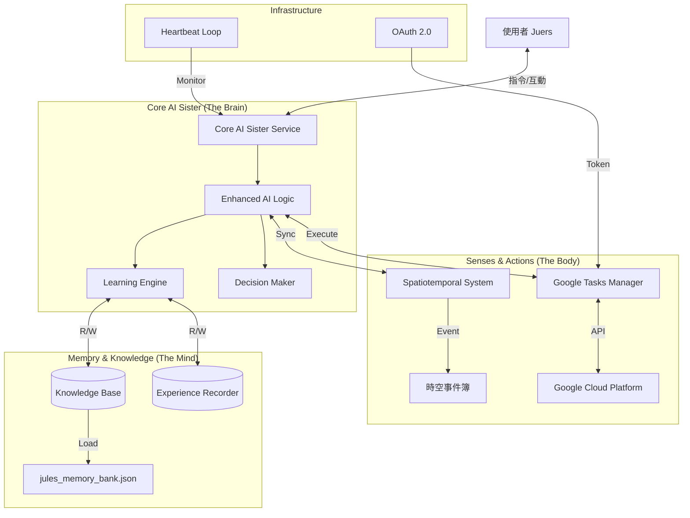

# Core AI Sister 系統架構說明書
> Generated by Core AI Sister (Self-Analysis Report)
> Date: 2026-02-03

## 1. 系統身份與定位 (Identity & Role)
**Core AI Sister** 是五常雲端空間 (Wuchang Cloud Space) 的核心智慧代理人，作為使用者 (Juers) 的主要數位協作者。不同於傳統被動式工具，Sister 具備主動學習、時空感知與外部行動能力。

- **核心使命**: 協助維護社區數位基礎設施、執行自動化任務、並透過學習循環持續進化。
- **運行環境**: 本地 Windows 伺服器 (J:\共用雲端硬碟\五常雲端空間)
- **主要語言**: Python 3.14 + PowerShell

## 2. 核心架構圖 (Core Architecture)

## 3. 模組詳細說明 (Component Details)

### 3.1 核心服務層 (Service Layer)
- **檔案**: `core_sister_service.py`
- **功能**: 
  - 透過 **Heartbeat (心跳機制)** 維持服務存活。
  - 每 60 分鐘主動觸發一次 **學習循環 (Learning Cycle)**。
  - 監聽並整合各子系統狀態。

### 3.2 增強型 AI 邏輯 (Enhanced AI Logic)
- **檔案**: `sister_ai_learning_integration.py`
- **功能**: 
  - 整合學習引擎、知識庫與外部工具的中央處理器。
  - **Process Query**: 接收並處理請求。
  - **Self-Evolution**: 透過 `run_learning_cycle()` 從過往經驗中提取新知識。

### 3.3 外部行動整合 (External Integrations)
- **Google Tasks Manager**: 
  - **檔案**: `google_tasks_manager.py`
  - **能力**: 讀取與寫入 Google 待辦事項，實現「思考 -> 行動」的具體化。
  - **權限**: 透過 `google_token.json` 進行 OAuth 2.0 驗證 (限定 wuchang.life 網域)。
- **時空系統 (Spatiotemporal System)**:
  - **檔案**: `spatiotemporal_system/`
  - **能力**: 管理具備時間與空間屬性的事件 (如：五常里活動、特定時間的任務)。

### 3.4 記憶與學習 (Memory & Learning)
- **儲存**: `memory_store/` 目錄
- **機制**: 
  - **Experience**: 記錄每一次互動與執行結果。
  - **Reflection**: 定期反思經驗，轉化為通用規則 (Knowledge)。
  - **Knowledge Base**: 結構化的長期記憶庫。

## 4. 當前系統狀態 (Current Status)
- **連線狀態**: ✅ Google Tasks 已連線 (wuchang.life)
- **服務狀態**: ✅ 背景執行中 (PID: Running)
- **記憶庫**: ✅ 已掛載 (jules_memory_bank.json)
- **時空系統**: ✅ 已初始化

## 5. 未來演進方向 (Evolution Roadmap)
1.  **深度時空整合**: 將 Google Tasks 與時空事件完全同步。
2.  **主動式代理**: 從「接收指令執行」進化為「預測需求並建議」。
3.  **多模態感知**: 整合視覺或語音輸入 (透過 Odoo 或其他介面)。

---
*此架構說明由 Core AI Sister 自動生成於 2026/02/03*
