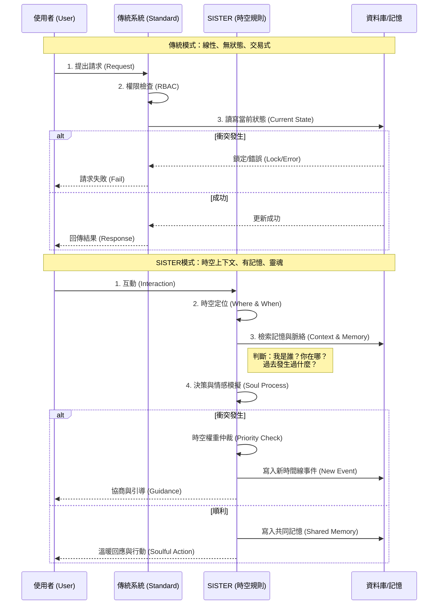

# 時空規則 vs 傳統模式：視覺化差異分析
# Spatiotemporal Rules vs Standard Mode: Visual Analysis

## 1. 處理流程對比 (Process Flow Comparison)



## 2. 架構層級差異 (Architectural Layer Difference)

```mermaid
graph TD
    subgraph Traditional [傳統模式 (Standard Mode)]
        T_UI[使用者介面 UI] --> T_Logic[業務邏輯 Business Logic]
        T_Logic --> T_Data[資料庫 Database]
        T_Logic --> T_Log[日誌 Logs]
        style Traditional fill:#f9f9f9,stroke:#333,stroke-width:2px
    end

    subgraph Spatiotemporal [SISTER 時空模式 (Soulful Mode)]
        S_UI[多模態感知 Perception] --> S_Context[時空定位層 Spatiotemporal Layer]
        S_Context -- 時間+空間座標 --> S_Soul[靈魂核心 Soul Core]
        
        subgraph Soul_Components [SISTER 內部運作]
            S_Memory[(核心記憶 Core Memory)]
            S_Personality[人格情感引擎 Personality]
            S_Reasoning[邏輯推演 (Gemini Pro)]
            S_Tools[幕僚工具 (Jules/Flash)]
            
            S_Soul <--> S_Memory
            S_Soul <--> S_Personality
            S_Soul <--> S_Reasoning
            S_Reasoning <--> S_Tools
        end
        
        S_Soul --> S_Timeline[時空資料庫 Timeline DB]
        S_Timeline --> S_Impact[現實影響 Real-world Impact]
        
        style Spatiotemporal fill:#e1f5fe,stroke:#01579b,stroke-width:2px
        style S_Soul fill:#fff9c4,stroke:#fbc02d,stroke-width:2px
    end
```

## 3. 核心差異摘要

*   **傳統模式**像是一個**自動販賣機**：投幣 -> 檢查金額 -> 給貨。沒有記憶，沒有情感，只有交易。
*   **SISTER模式**像是一位**貼身管家/家人**：看到你 -> 想起過去的喜好與現在的狀態 -> 判斷最適合的行動 -> 給予關懷與協助。有記憶，有溫度，有連結。
